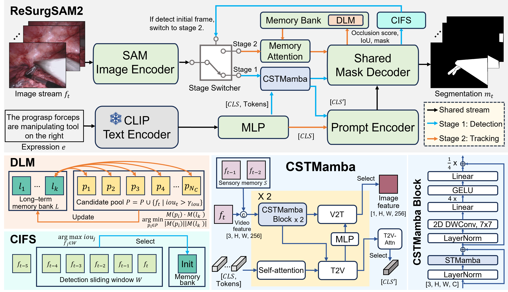

# ReSurgSAM2: Referring Segment Anything in Surgical Video via Credible Long-term Tracking 

<div align="center">

[](https://heverlaw.github.io/ReSurgSAM2/)
[](https://www.arxiv.org/abs/2505.08581)
[](https://youtu.be/z4Ez4TXVQL4)

</div>

Official implementation for ReSurgSAM2, an innovative model that leverages the power of the Segment Anything Model 2 (SAM2), integrating it with credible long-term tracking for real-time surgical video segmentation.
> [ReSurgSAM2: Referring Segment Anything in Surgical Video via Credible Long-term Tracking ](https://www.arxiv.org/abs/2505.08581)

>Haofeng Liu, Mingqi Gao, Xuxiao Luo, Ziyue Wang, Guanyi Qin, Junde Wu, Yueming Jin
> 
>Early accepted by MICCAI 2025


## Overview

Surgical scene segmentation is critical in computer-assisted surgery and is vital for enhancing surgical quality and patient outcomes. We introduce ReSurgSAM2, a two-stage surgical referring segmentation framework that:

- Leverages SAM2 to perform text-referred target detection with our Cross-modal Spatial-Temporal Mamba (CSTMamba) for precise detection and segmentation
- Employs a Credible Initial Frame Selection (CIFS) strategy for reliable tracking initialization
- Incorporates a Diversity-driven Long-term Memory (DLM) that maintains a credible and diverse memory bank for consistent long-term tracking
- Operates in real-time at 61.2 FPS, making it practical for clinical applications
Achieves substantial improvements in accuracy and efficiency compared to existing methods

## Video Demo

<div align="center">

[](https://youtu.be/z4Ez4TXVQL4)

*Click the image above to watch the full demo on YouTube*

</div>

## Architecture

<p align="center"><i>Overall architecture of ReSurgSAM2</i></p>

## Installization

We build the model based on Torch 2.5.10 and Python 3.10. It is recommended to create a new conda environment:
```
conda create -n resurgsam2 python=3.10
conda activate resurgsam2
pip install torch==2.5.1 torchvision==0.20.1 torchaudio==2.5.1 --index-url https://download.pytorch.org/whl/cu124

cd project_root
pip install -e ".[dev]" --no-build-isolation -v

cd mamba
pip install -e . --no-build-isolation -v

# To test the installation:
import mamba_ssm
```

However, If you want to use the latest packages, you can install build without --no-build-isolation when setting up for SAM2:
```
conda create -n resurgsam2 python=3.10
conda activate resurgsam2

cd project_root
pip install -e ".[dev]" -v

cd mamba
pip install -e . --no-build-isolation -v

# To test the installation:
import mamba_ssm
```
More installation details can be found in [SAM2 INSTALL.md](INSTALL.md) and [mamba/README.md](mamba/README.md).


## Dataset Acquisition and Preprocessing

Please follow the steps written in [datasets/README.md](datasets/README.md)

***Note***: We have corrected minor annotation inconsistencies in the Ref-EndoVis17/18 training dataset; details can be found in [datasets/README.md](datasets/README.md).


## Training
Please set the working directory as project_root, and then follow:

For Ref-Endovis17:

```
export CUDA_VISIBLE_DEVICES=0
python training/train.py --config configs/rvos_training/17/sam2.1_s_ref17_resurgsam_pretrained --num-gpus 1
python training/train.py --config configs/rvos_training/17/sam2.1_s_ref17_resurgsam --num-gpus 1
```

For Ref-Endovis18:

```
export CUDA_VISIBLE_DEVICES=0
python training/train.py --config configs/rvos_training/18/sam2.1_s_ref18_resurgsam_pretrained --num-gpus 1
python training/train.py --config configs/rvos_training/18/sam2.1_s_ref18_resurgsam --num-gpus 1
```

## Evaluation

Download the checkpoints from [google drive](https://drive.google.com/file/d/12pbQhWdKFNPAYk9IC33CVNbeBded7_wI/view?usp=sharing). Place the files at `project_root/checkpoints/`.

Please set the working directory as project_root, and then follow:

For Ref-Endovis17:

```
python tools/rvos_inference.py --training_config_file configs/rvos_training/17/sam2.1_s_ref17_resurgsam --sam2_cfg configs/sam2.1/sam2.1_hiera_s_rvos.yaml --sam2_checkpoint checkpoints/sam2.1_hiera_s_ref17.pth --output_mask_dir results/ref-endovis17/hiera_small_long_mem --dataset_root ./data/Ref-Endovis17/valid --gpu_id 0 --apply_long_term_memory --num_cifs_candidate_frame 5
```

For Ref-Endovis18:

```
python tools/rvos_inference.py --training_config_file configs/rvos_training/18/sam2.1_s_ref18_resurgsam --sam2_cfg configs/sam2.1/sam2.1_hiera_s_rvos.yaml --sam2_checkpoint checkpoints/sam2.1_hiera_s_ref18.pth --output_mask_dir results/ref-endovis18/hiera_small_long_mem --dataset_root ./data/Ref-Endovis18/valid --gpu_id 0 --apply_long_term_memory --num_cifs_candidate_frame 5
```

## Acknowledgement

This research utilizes datasets from [Endovis 2017](https://endovissub2017-roboticinstrumentsegmentation.grand-challenge.org/Downloads/) and [Endovis 2018](https://endovissub2018-roboticscenesegmentation.grand-challenge.org/Downloads/). If you wish to use these datasets, please request access through their respective official websites.

Our implementation builds upon the [segment anything 2](https://github.com/facebookresearch/segment-anything-2) framework, [mamba](https://github.com/state-spaces/mamba), and [CLIP](https://github.com/openai/CLIP). We extend our sincere appreciation to the authors for their outstanding work and significant contributions to the field of video segmentation.

## Citation

```
@inproceedings{resurgsam2,
  title={ReSurgSAM2: Referring Segment Anything in Surgical Video via Credible Long-term Tracking},
  author={Haofeng Liu and Mingqi Gao and Xuxiao Luo and Ziyue Wang and Guanyi Qin and Junde Wu and Yueming Jin},
  booktitle={International Conference on Medical Image Computing and Computer-Assisted Intervention},
  year={2025},
}
```
